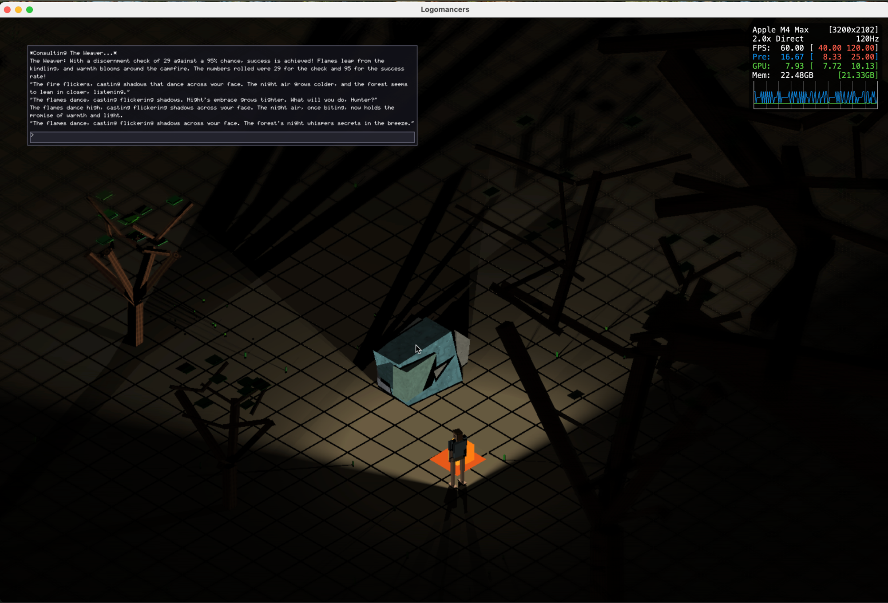
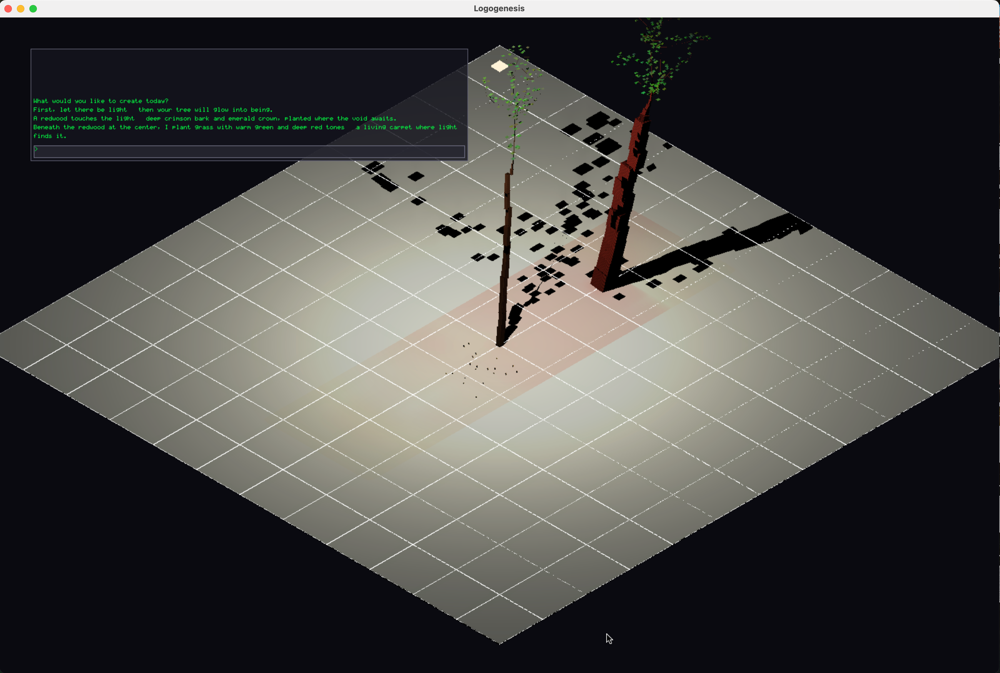
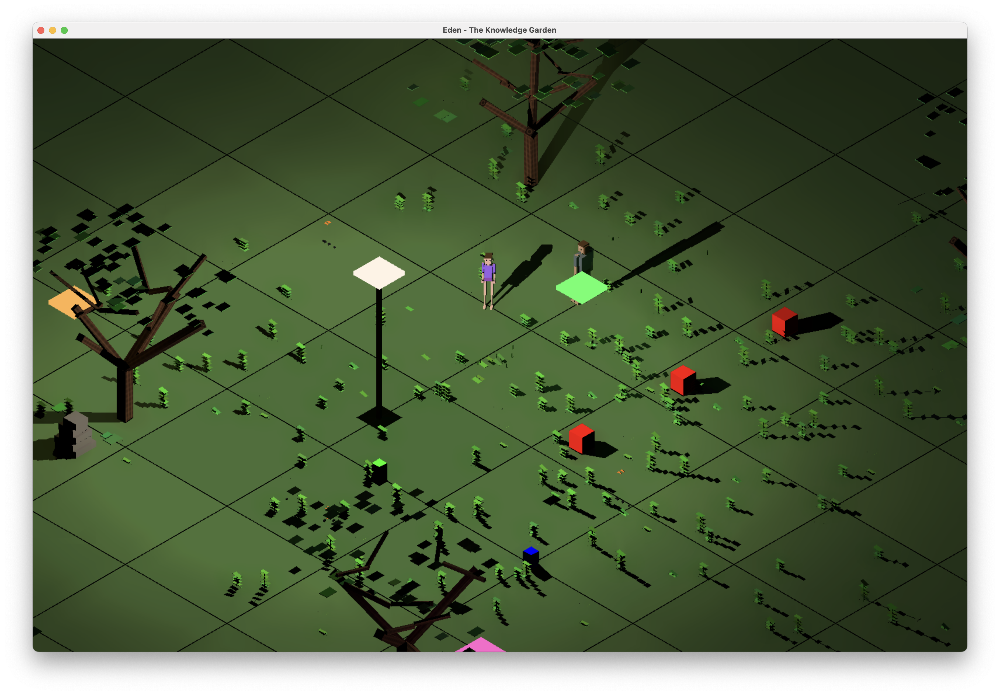
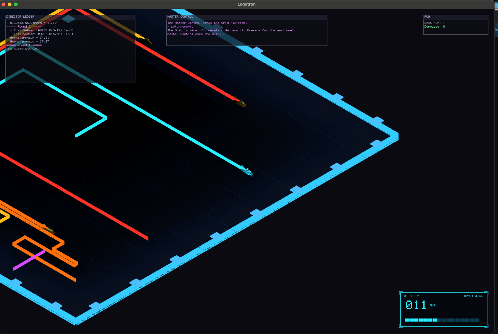

# Logosphere

A game engine where everything is a particle and every particle is a
node in a knowledge graph. Walls, creatures, trees, fire, the sun:
one substrate, all of it queryable, all of it mutable, all of it
fair game for a language model holding the ops grammar.

No OpenGL, no Vulkan, no DirectX. A software rasterizer writes the
framebuffer and Metal compute shaders trace the light. Games declare
their entity types, relations, and events in YAML; the engine
provides capability aggregation, response rules, and a typed event
bus on top.



*Logomancers, a commercial game in development on Logosphere: a
hunter's campfire against the night, every light computed, every
shadow the absence of it, narrated live by an LLM Weaver rolling
real dice.*

## Where this comes from

Logos is the old Greek word that never translates clean. Word,
speech, reason, account: the principle that orders a thing and the
act of saying it, both at once. Heraclitus used it for the pattern
underneath change. A sphere is a world with nothing outside it.
Media theorists already had "logosphere" for the realm where
language lives; I took the word literally. A world made of word.
Speak, and it is so.

The project started with one raw idea: give a language model control
of a world. Not a chatbot bolted onto a quest log, not dialogue
trees with better sentences. Control. The model should be able to
make a tree exist, raise the ground, redesign an opponent mid-match,
change the hour of the sky, and break things it shouldn't, in a
world physical enough that its choices carry weight.

I tried the obvious route first, on paper: take a mature engine and
wire a model into it. Every path I traced hit the same wall.
Existing engines are built for human authors with human tools; their
world state lives in scene graphs, prefabs, serialized editor magic,
in places a model can't see and shouldn't blindly touch. You end up
handing the model a puppet with three strings, spawn here, play
animation, set flag, and calling it control.

So the engine got written from zero, around the opposite bet: make
the whole world one legible, mutable substrate. Everything is a
particle. Every particle is a node in a knowledge graph. Types,
relations, and events are declared in an ontology the model reads
like a spec sheet, and the only way anything changes, whether the
mover is the player, the physics, or the model, is through
operations validated against that ontology. An LLM holding the ops
grammar has the same hands the game itself has. That is the root of
the project. Everything else here, the software rasterizer, the
turtle at z = 0, the shadows that are only the absence of light,
grew from taking that one bet seriously.

The idea also came with a deadline, by accident. It arrived around
the time I decided to finally finish my degree, and the final
project became the channel: nearly all my free time went into the
engine, and the thesis gave that obsession a shape and a due date.
The university marked it Matrícula de Honor, the distinction it
gives to a handful of projects a year. The degree closed. The engine
kept going.

## Status

Pre-1.0, and honest about it: the API can break between commits, and
every break lands in [CHANGELOG.md](CHANGELOG.md). Three example
games keep the engine pressed against real workloads. The headless
core builds on any C++17 toolchain; the full graphical engine is
macOS arm64 today.

Source-available under the [Logosphere License 1.0](LICENSE.md).
Read it, fork it, ship a commercial game on it. Once your product
clears US$100,000 lifetime gross, 5% of the revenue above that comes
back here.

## What makes it different

- **Particle-first, not mesh-first.** No triangle meshes anywhere.
  Spheres and boxes with mass and density, and physics and rendering
  argue over the same data.
- **KG-native.** Damage, capabilities, and state changes flow through
  the graph. There is no second bookkeeping layer to drift out of
  sync, which is the point.
- **Ontology-driven.** Games declare their types in LinkML YAML, a
  generator emits typed C++, and `extend()` grows the ontology at
  runtime. The schema the validator enforces is the same sheet the
  LLM reads.
- **Declared interactions.** Water, force fields, trail fades: KG
  data, not engine special cases. Interaction profiles and masks
  decide what rigid-contacts what; passable media apply drag,
  buoyancy, and field forces; transformation rules fire declared
  effects.
- **Configurable everything.** Capability rules, triggers, effects,
  event types: declared in the ontology or registered at startup.
  Engine logic dispatches through lookup tables, not hardcoded
  switches.
- **Rules that check themselves.** A published rulebook can be read
  into the graph as cited data: every value proves itself against the
  sentence or table cell that states it, and every roll records the
  rule entity that made it. The graph plus the dice journal is then
  enough to re-derive what a rule permitted and compare it to what
  happened, so a rule added tomorrow is checked without anyone writing
  a test for it. See [Rules as Data](docs/RULES_AS_DATA.md).
- **Runs you can replay exactly.** Any game runs headless, with no
  window and no clock, and what happened is kept separate from what was
  decided. A run records to a tape and replays byte for byte, so a bug
  found by sweeping thousands of runs arrives as a seed rather than a
  description. See [Record and Replay](docs/RECORD_AND_REPLAY.md).
- **Opt-in subsystems.** Damage, LLM, capabilities. A puzzle game
  uses none of them, a combat game uses all of them, the engine does
  not care either way.

## Example games

### Logogenesis, Speak a World into Being



You stand in a black phosphor-grid void and type what you want to
exist. "A beautiful tree": an LLM authors validated knowledge-graph
operations and the engine grows a real space-colonization tree. "A
forest of oaks and pines": fifteen trees in one breath. "Real earth,
and a meteor from the sky": layered particle ground pours in and
settles under live physics, then a boulder falls, craters the
topsoil, and buries itself. Plant a sapling and watch its whole life
as a time-lapse. Ask for someone to wander among the trees.

The sun, moons, and stars are real simulated celestial particles far
enough to never enter the frame; only their light arrives. No level
editor, no scripting. Conversation.

[`examples/logogenesis/README.md`](examples/logogenesis/README.md)

### Eden, the Knowledge Garden



The first thing the engine had to prove. Eva, Adam, the Tree, the
Apple, the Serpent: each a particle, each a typed node with
relations. Walk Eva to the tree and attraction relations fire; take
the apple and consequence relations do. The scene doubles as the
ontology layer's integration test, which is what a garden is for
around here.

[`examples/eden/EDEN.md`](examples/eden/EDEN.md)

### Logotron, Light Cycles with an LLM Director



Light-cycle arena, you against one AI at a time. Leave a solid trail,
crash into anything, lose the round. Beat the AI and the Director, an
LLM holding the same ops grammar as everything else, studies the
round and authors your next opponent: new personality, new tactics.
Sometimes it resizes the arena mid-match, because it can.

Every trail segment is a new KG node. The Director runs against
remote providers (OpenAI, Anthropic) or a local server.

[`examples/logotron/LOGOTRON.md`](examples/logotron/LOGOTRON.md)

### Logovger, a Rulebook Read Into the Graph

A published tabletop RPG rulebook, ingested until it is playable. The
Cepheus Engine SRD goes in as markdown; what comes out is a character
generator you sit at, where every value on the sheet can be clicked
and the book answers with the table cell it came from.

None of the rules are written in C++. Careers, throws, skill tables,
rank ladders and mustering-out benefits are entities in the knowledge
graph, loaded from seed files that must prove themselves first: an
ingestion verifier resolves every citation back into the source text
and refuses the seed when a quote, a number or a table address does
not match. Dice are engine-side, seeded and journalled, so a life
replays exactly and every result cites the roll that made it.

That discipline is not decoration. Reading three thousand rule
entities out of one chapter surfaced four defects in the published
book, including a skill that two career tables grant and the rules
never define. Each was reported upstream rather than quietly
corrected, and the ones the book's own text proves wrong are fixed at
source with the divergence recorded.

An LLM narrates what the dice already decided and cannot contradict
them, because it is handed facts and asked only for prose. It runs
against a hosted model or a local one; same rules, same character,
either way.

[`examples/logovger/README.md`](examples/logovger/README.md) ·
[`docs/RPG_MODULE.md`](docs/RPG_MODULE.md)

## Platform

Three build profiles, selected with `-DLOGOSPHERE_PROFILE=<full|physics|core>`:

- **Full engine** (`full`, default): macOS arm64. Software rasterizer,
  Metal compute shaders for shadows and lighting, XPBD physics, GLFW
  windowing, example games. The macOS dev workflow.
- **Headless physics** (`physics`): the full engine minus GPU and
  windowing: a render-free `Engine` (null platform, stubbed GPU, no
  GLFW) plus solver, gluons, dynamics, locomotion, and worldgen. Runs
  the complete locomotion guard suite on Linux CI on every PR. Builds
  on any C++17 toolchain.
- **Headless core** (`core`, or the legacy alias
  `-DLOGOSPHERE_HEADLESS_ONLY=ON`): builds `liblogosphere_core.a` plus
  the pure-C++ standalone test executables on any C++17 toolchain.
  Knowledge graph, capability rules, damage system, event bus,
  ontology, game time. Linux is verified in CI; Windows is structurally
  compatible but untested.

## Quick start

### macOS (full engine)

```bash
brew install glfw pkg-config cmake

cmake -S . -B build -DCMAKE_OSX_ARCHITECTURES="arm64"
cmake --build build --config Release

./build/eden/eden                    # the knowledge-garden example
./build/logotron/logotron            # the light-cycle example
./build/logogenesis/logogenesis      # conversational world creation
./build/logovger/logovger            # character creation from a rulebook
./build/logosphere-tests --no-head   # the combined test harness
```

Or via Make shortcuts:
```bash
make eden    # build and run
make test    # build and run test suite
```

### Linux (or any C++17 toolchain)

```bash
sudo apt-get install -y cmake g++ ninja-build   # or your distro's equivalent

# Headless physics: render-free Engine + the locomotion guard suite
cmake -S . -B build-physics -G Ninja -DLOGOSPHERE_PROFILE=physics
cmake --build build-physics -j
./build-physics/logosphere-physics-guards

# Headless core: the pure-C++ subset (cheapest smoke)
cmake -S . -B build-headless -G Ninja -DLOGOSPHERE_HEADLESS_ONLY=ON
cmake --build build-headless -j
for t in test_event_log test_signal test_event_channel test_event_bus \
         test_damage_events test_capability_system test_ontology_extension \
         test_body_plan test_game_time test_kg_setproperty_events \
         test_relation_events test_kg_parse_safety; do
  ./build-headless/$t || break
done
```

This is what GitHub Actions runs on every push (the `physics-linux`
and `headless-linux` jobs).

## Build outputs

| Target | Path | Profile | Description |
|---|---|---|---|
| `liblogosphere_core.a` | `build/` | both | Headless-safe subset (KG, capability, damage, events, ontology, game time) |
| `liblogosphere.a` | `build/` | full | Full static engine library (supersets `_core`) |
| `logosphere-tests` | `build/` | full | Combined test harness |
| `eden` | `build/eden/` | full | Eden example game |
| `logotron` | `build/logotron/` | full | Logotron example game |
| `logogenesis` | `build/logogenesis/` | full | Logogenesis example game |
| `logovger` | `build/logovger/` | full | Logovger, character creation from an ingested rulebook |
| `logovger-bench-narrator` | `build/examples/logovger/` | full | Measures the wait between a decision and its narration |
| Standalone headless tests | `build/test_*` | both | 46 standalone executables (KG, capability, damage, events, ontology, physics guards) |
| Other standalone tests | `build/test_*` | full | Physics, rendering, animation, etc. |

## Documentation

**New here?** Start with **[Getting Started](docs/GETTING_STARTED.md)**,
the end-to-end tutorial for building your first game.

**Building on the engine?** Read **[Game Layer](docs/GAME_LAYER.md)**,
the canonical API reference (IApplication, ontology extension, event
bus, capability rules).

**Understanding the engine?** **[Architecture](docs/ARCHITECTURE.md)**
holds the invariants every change must honor;
**[Module Architecture](docs/MODULE_ARCHITECTURE.md)** maps the
Core / Modules / Plugins organization.

**Bringing an existing rulebook?** Read **[Rules as
Data](docs/RULES_AS_DATA.md)** before you start. It covers where the
line between rule-as-data and rule-as-code actually falls, why a rule
must never be found by its printed name, how a value proves itself
against the text that states it, and the failure modes we hit absorbing
the Cepheus Engine SRD.

**Contributing to the engine?** See **[docs/INDEX.md](docs/INDEX.md)**
for the full documentation table of contents organized by audience,
and **[CONTRIBUTING.md](CONTRIBUTING.md)** for repo layout and
conventions.

## Engine systems

### Core (stable, always present)

| System | Description |
|---|---|
| `ParticleSystem` | All particle data and lifecycle |
| `Renderer` / `Display` | Software rasterization to framebuffer, Metal-accelerated lighting, swappable display surface |
| `PhysicsSystem` | XPBD physics with iterative contact resolution |
| `LightSystem` | Deferred lighting with BVH-accelerated shadow rays |
| `ParticleDynamicsSystem` | FK/IK animation, motor forces, look-at |
| `KGModule` | Knowledge graph (typed entities, relations, properties) |
| `EventBus` | Typed event channels (signals + log tier) |

### Game layer (opt-in)

| System | Description |
|---|---|
| `CapabilityProfile` | KG-driven capability aggregation (locomotion, manipulation, etc.) |
| `DynamicsParams` | Game-overridable dynamics derivation |
| `TriggerRegistry` | Pluggable response-rule triggers |
| `EffectRegistry` | Pluggable response-rule effects |
| `DamageSystem` | Generic HP tracking with typed resistance |
| `ParticleInteractionSystem` | KG-declared interaction profiles: contact masks, passable media (drag/buoyancy/field), declarative particle transformations |
| `WorldGenSystem` | Procedural generation (trees, terrain, rocks) |

### External integrations

| System | Description |
|---|---|
| `LLMSystemHTTP` | Text generation via external LLM server (optional, nullable) |

## Rendering pipeline

Three-pass GPU deferred, every frame:

1. **G-Buffer.** Software rasterize particles to world position,
   normal, color, ID.
2. **Shadow + Lighting.** Metal compute, all lights in one pass, BVH
   ray traversal.
3. **Apply.** Combine G-buffer and lighting into framebuffer pixels.

## What it can't do yet

- The full engine runs on macOS arm64 only. Linux gets the headless
  profiles; Windows is structurally compatible and unverified.
- No scripting layer. Games are C++ binaries linked against the
  library, on purpose for now.
- No built-in save/load; that is the game's job.
- `IApplication::create_initial_scene` takes only a particle-add
  callback today; richer scene declaration is
  [planned](include/application.h) (TODO[ARCH-003]).
- Pre-1.0 API churn is a promise, not a risk. Every break is in the
  changelog.

## License

[Logosphere License 1.0](LICENSE.md). Source-available; free to use,
modify, and ship, including commercially. Products beyond US$100,000
lifetime gross revenue owe a 5% royalty on revenue above the
threshold (contact hello@kieleth.com).

## Contributing

See [CONTRIBUTING.md](CONTRIBUTING.md). Changes to public API or behavior
get a line in [CHANGELOG.md](CHANGELOG.md) under `[Unreleased]`.

This project follows the [Contributor Covenant Code of Conduct](CODE_OF_CONDUCT.md).

Release workflow: [docs/RELEASING.md](docs/RELEASING.md).

## About

Built by [Kieleth](https://kieleth.com).
