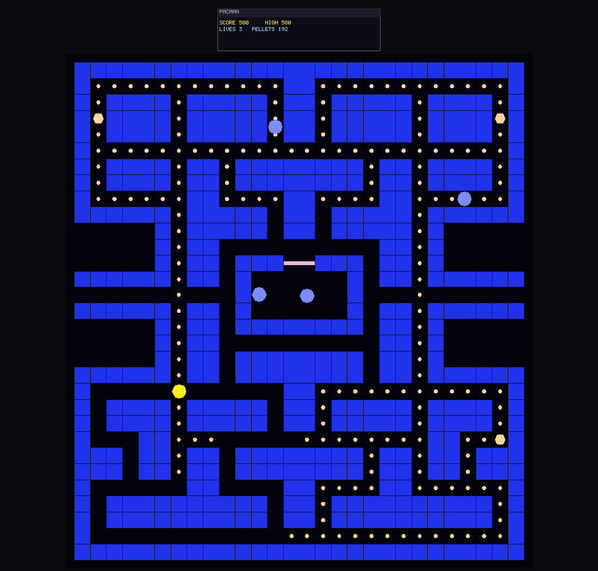
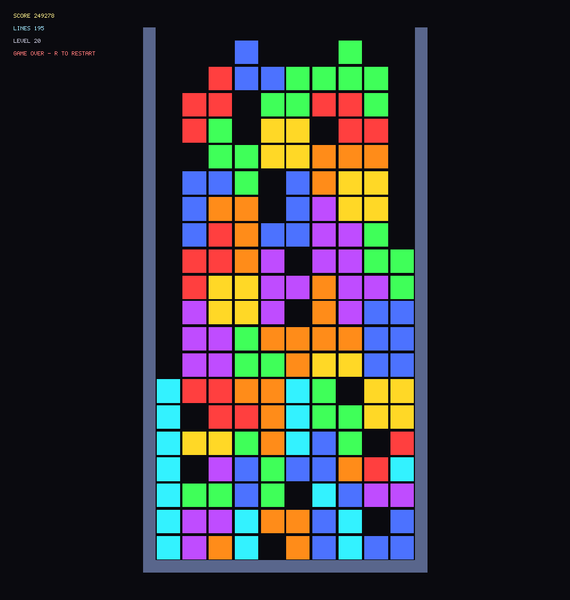

# Logosphere

A game engine where everything is a particle and every particle is a
node in a knowledge graph. Walls, creatures, trees, fire, the sun:
one substrate, all of it queryable, all of it mutable.

No OpenGL, no Vulkan, no DirectX. A software rasterizer writes the
framebuffer and Metal compute shaders trace the light. Games declare
their entity types, relations, and events in YAML; the engine
provides capability aggregation, response rules, and a typed event
bus on top.

The world is legible enough that a language model can hold the same
ops grammar the game holds and author into it under the same
validation as everything else. That bet is where the engine came
from, and taking it is optional. The LLM system is nullable, the
physics and the graph each stand alone, and a game that uses no AI
loses nothing that was built for AI.


*Logomancers, a commercial game in development on Logosphere: a
hunter's campfire against the night, every light computed, every
shadow the absence of it, narrated live by an LLM Weaver rolling
real dice.*

## Start here

**What do I have to adopt?** Less than you think. Three build profiles,
and each is a real product rather than a stripped demo.

| Profile | You get | Platform |
|---|---|---|
| `core` | Knowledge graph, ontology, capability rules, damage, event bus, game time | Any C++17 toolchain |
| `physics` | The above plus a render-free engine: solver, contacts, gluons, dynamics, locomotion, worldgen | Any C++17 toolchain |
| `full` | Everything, plus software rasterizer, Metal lighting, GLFW, the example games | macOS arm64 |

Use the physics and forget the graph. Use the graph and never open a
window. Switch the model off and nothing asks about it. A puzzle game
uses none of the AI, a combat game uses all of it, and the engine does
not care either way.

**What can it actually do, and how finished is each part?**
[docs/CAPABILITIES.md](docs/CAPABILITIES.md) is one page, every claim
carrying what backs it, every gap stated. Read it before you commit a
weekend.

**Do I have to write the C++ myself?** There is no scripting layer, so
games are C++ binaries linked against the library. That is a real cost
and we will not pretend otherwise. But you may not have to type it:
see [For my little sister](#for-my-little-sister), below, where two AI
agents each built a game here in under half an hour and we published
the receipts.

## For my little sister

My sister has never written a line of C++ and is not going to start.
This part is for her. If you write games for a living, skip to
[Quick start](#quick-start), you will find this section slow.

Here is the thing worth knowing: **nobody typed these two games.**





Two AI coding agents, two fresh copies of this repository, one
instruction each, nobody to ask for help. A playing Pacman in **29
minutes** and a playing Tetris in **25**. Neither changed a single line
of the engine. Both wrote their own tests and ran them. Those two
pictures are frames the games actually rendered, not mockups: Pacman is
paused twelve seconds into a bot's run, Tetris is the moment it topped
out at 195 lines. The whole account, including the five things our
documentation got wrong and made them waste time on, is in
[docs/NEWCOMER_RUNS.md](docs/NEWCOMER_RUNS.md), prompts included.

So the honest instruction for a beginner is not "learn C++ first". It is
"get the engine on your Mac, point a coding agent at it, and ask".

### Getting it onto your Mac, assuming nothing

Ten minutes, most of it waiting for downloads. Every command below only
ADDS things to your machine. None of them delete anything.

**1. Open Terminal.** Press `Cmd` and `Space` together, type `Terminal`,
press `Enter`. A window with text appears. That is it. That is the scary
part over.

**2. Get Apple's developer tools.** Paste this, press `Enter`, and click
through the box that pops up:

```bash
xcode-select --install
```

**3. Get Homebrew,** which installs the rest. Copy the one-line command
from [brew.sh](https://brew.sh), paste it, press `Enter`. It will ask
for your password: that is normal, and it will not show anything as you
type it.

**4. Get the three things the engine needs:**

```bash
brew install cmake glfw pkg-config
```

**5. Get Logosphere and build it.** The build takes a few minutes and
prints a great deal of noise. Noise is fine. Only the word `error`
matters:

```bash
git clone https://github.com/Kieleth/logosphere
cd logosphere
cmake -S . -B build -DCMAKE_OSX_ARCHITECTURES="arm64"
cmake --build build -j
```

**6. Play the games somebody else's robot wrote:**

```bash
./build/pacman/pacman     # arrow keys
./build/tetris/tetris     # arrows, space to drop, R to restart
./build/minimal/minimal   # five boxes and nothing else, on purpose
```

If Pacman appears, you have a working game engine on your computer and
you have not written anything yet.

### Now make it yours

Install [Claude Code](https://claude.com/claude-code) or Codex, open it
in the `logosphere` folder, and type what you want. Not pseudo-code, not
a spec. What you want.

The two agents got a long, careful prompt because we were running an
experiment and wanted them to keep a log. You do not need any of that.
This is enough:

> Build me a playable Snake in this repository. It is a game engine. Read
> `examples/minimal/main.cpp` first, then `docs/GETTING_STARTED.md`, and
> work out the rest by reading the code. Test it as you go and tell me
> honestly if something does not work.

Then let it run. It will read for a while before it writes anything.
That is the part that works.

### Prompts worth trying next

Once you have something on screen, these are the ones that show off what
this engine can do that most cannot. Each is a sentence you type, not a
project you plan.

- *"Make the maze fully 3D and tilt the camera down at 45 degrees."* The
  world already is 3D. The flat look is one projection setting, so this
  is a smaller change than it sounds.
- *"Turn off the lights and give Pacman a torch that casts real
  shadows."* Light here is computed and shadow is the absence of it, so
  the ghosts will genuinely hide behind corners. Nobody has to draw that.
- *"Make the pellets physical, so the ones I miss roll down the corridor
  and pile up."* Every pellet is already a body with mass and a material.
- *"Let a language model redesign the maze every time I lose a life, and
  make it harder each time."* The model writes into the same validated
  world the game does, so it cannot produce an illegal maze.
- *"Give each ghost a personality and let the model rewrite the one that
  killed me."* This is exactly what the Logotron example does with light
  cycles, so there is working code to point your agent at.
- *"Make the Tetris pieces heavy and let them topple when the stack is
  uneven."* Real rigid bodies, real rotation, immediate chaos.
- *"Add weather. I want it to snow in the maze."*

None of those are hypothetical features. Each one leans on something the
engine already does and the
[capabilities page](docs/CAPABILITIES.md) will tell you which.

When it goes wrong, and it will, paste the error back to the agent and
say "this failed, fix it". That is the entire debugging technique and it
works more often than it has any right to.

## Where this comes from

The project started with one bet: give a language model real control
of a world, not a chatbot bolted onto a quest log. Every mature engine
keeps its world state in scene graphs and serialized editor magic,
where a model cannot see it, so this one got written from zero around
the opposite idea. One legible substrate, one ontology, and no
privileged writer.

Chasing legibility for a model produced an engine that is legible,
full stop, and that is the part you keep whether or not you ever call
a model. The full account, the word it is named after, and what the
bet cost: [docs/WHY.md](docs/WHY.md).

## Status

Pre-1.0, and honest about it: the API can break between commits, and
every break lands in [CHANGELOG.md](CHANGELOG.md). Three example
games keep the engine pressed against real workloads. The headless
core builds on any C++17 toolchain; the full graphical engine is
macOS arm64 today.

Source-available under the [Logosphere License 1.0](LICENSE.md).
Read it, fork it, ship a commercial game on it. Once your product
clears US$100,000 lifetime gross, 5% of the revenue above that comes
back here.

## What makes it different

- **Modular to the point of indifference.** Damage, LLM, capabilities,
  rendering: every one of them is opt-in, and the engine never checks
  whether you took it. The physics runs render-free on Linux. The
  graph runs without a GPU. Nothing degrades because you left a
  subsystem out, because nothing below assumes it is there.
- **Particle-first, not mesh-first.** No triangle meshes anywhere.
  Spheres and boxes with mass and density, and physics and rendering
  argue over the same data.
- **KG-native.** Damage, capabilities, and state changes flow through
  the graph. There is no second bookkeeping layer to drift out of
  sync, which is the point.
- **Ontology-driven.** Games declare their types in LinkML YAML, a
  generator emits typed C++, and `extend()` grows the ontology at
  runtime. The schema the validator enforces is the same sheet the
  LLM reads.
- **Declared interactions.** Water, force fields, trail fades: KG
  data, not engine special cases. Interaction profiles and masks
  decide what rigid-contacts what; passable media apply drag,
  buoyancy, and field forces; transformation rules fire declared
  effects.
- **Configurable everything.** Capability rules, triggers, effects,
  event types: declared in the ontology or registered at startup.
  Engine logic dispatches through lookup tables, not hardcoded
  switches.
- **Rules that check themselves.** A published rulebook can be read
  into the graph as cited data: every value proves itself against the
  sentence or table cell that states it, and every roll records the
  rule entity that made it. The graph plus the dice journal is then
  enough to re-derive what a rule permitted and compare it to what
  happened, so a rule added tomorrow is checked without anyone writing
  a test for it. See [Rules as Data](docs/RULES_AS_DATA.md).
- **Runs you can replay exactly.** Any game runs headless, with no
  window and no clock, and what happened is kept separate from what was
  decided. A run records to a tape and replays byte for byte, so a bug
  found by sweeping thousands of runs arrives as a seed rather than a
  description. See [Record and Replay](docs/RECORD_AND_REPLAY.md).

## Reflection: somebody else's rulebook, playable

*Work in progress, and the most differentiated thing here.*

Point the engine at a published body of rules and it becomes game
knowledge that cites itself. Not a re-implementation of the rules in
C++: the careers, throws, skill tables, and rank ladders are entities
in the graph, loaded from seeds that must prove themselves before
anything runs. Every captured value carries the verbatim text it came
from, and the verifier reopens the book at that address and refuses
the seed when a quote, a number, or a table address does not match.
**3,089 quotes checked, zero misses.**

The discipline pays for itself in defects nobody else catches. Reading
one chapter surfaced four errors in the published book, reported
upstream rather than quietly patched. It also caught one of ours:
twenty-three careers had a rank 0 skill grant that was cited to its
cell, verified against the source, counted by an invariant, and read
by no code at all, so every character came out a skill level short
while every check stayed green.

Honest ceiling: one chapter of one book. Extraction moves to paired
model readers with an arbiter, decided and not yet built. Scanned
books and PDFs are a single layer swap at the source, with the
contract already written down. Nothing about this is finished, and
every gap is named in the protocol rather than left for you to find.

[The Reflection Protocol](docs/REFLECTION_PROTOCOL.md) ·
[Rules as Data](docs/RULES_AS_DATA.md) ·
[what is gated and what is not](docs/CAPABILITIES.md)

## Example games

### Logogenesis, Speak a World into Being


You stand in a black phosphor-grid void and type what you want to
exist. "A beautiful tree": an LLM authors validated knowledge-graph
operations and the engine grows a real space-colonization tree. "A
forest of oaks and pines": fifteen trees in one breath. "Real earth,
and a meteor from the sky": layered particle ground pours in and
settles under live physics, then a boulder falls, craters the
topsoil, and buries itself. Plant a sapling and watch its whole life
as a time-lapse. Ask for someone to wander among the trees.

The sun, moons, and stars are real simulated celestial particles far
enough to never enter the frame; only their light arrives. No level
editor, no scripting. Conversation.

[`examples/logogenesis/README.md`](examples/logogenesis/README.md)

### Eden, the Knowledge Garden


The first thing the engine had to prove. Eva, Adam, the Tree, the
Apple, the Serpent: each a particle, each a typed node with
relations. Walk Eva to the tree and attraction relations fire; take
the apple and consequence relations do. The scene doubles as the
ontology layer's integration test, which is what a garden is for
around here.

[`examples/eden/EDEN.md`](examples/eden/EDEN.md)

### Logotron, Light Cycles with an LLM Director


Light-cycle arena, you against one AI at a time. Leave a solid trail,
crash into anything, lose the round. Beat the AI and the Director, an
LLM holding the same ops grammar as everything else, studies the
round and authors your next opponent: new personality, new tactics.
Sometimes it resizes the arena mid-match, because it can.

Every trail segment is a new KG node. The Director runs against
remote providers (OpenAI, Anthropic) or a local server.

[`examples/logotron/LOGOTRON.md`](examples/logotron/LOGOTRON.md)

### Logovger, a Rulebook Read Into the Graph

The playable end of the reflection work above. The Cepheus Engine SRD
goes in as markdown; what comes out is a character generator you sit
at, where every value on the sheet can be clicked and the book answers
with the table cell it came from.

None of the rules are written in C++. Careers, throws, skill tables,
rank ladders and mustering-out benefits are entities in the knowledge
graph. Dice are engine-side, seeded and journalled, so a life replays
exactly and every result cites the roll that made it. Among the four
defects the reading found in the published book: a skill that two
career tables grant and the rules never define.

An LLM narrates what the dice already decided and cannot contradict
them, because it is handed facts and asked only for prose. It runs
against a hosted model or a local one; same rules, same character,
either way.

[`examples/logovger/README.md`](examples/logovger/README.md) ·
[`docs/RPG_MODULE.md`](docs/RPG_MODULE.md)

## Platform

Three build profiles, selected with `-DLOGOSPHERE_PROFILE=<full|physics|core>`:

- **Full engine** (`full`, default): macOS arm64. Software rasterizer,
  Metal compute shaders for shadows and lighting, XPBD physics, GLFW
  windowing, example games. The macOS dev workflow.
- **Headless physics** (`physics`): the full engine minus GPU and
  windowing: a render-free `Engine` (null platform, stubbed GPU, no
  GLFW) plus solver, gluons, dynamics, locomotion, and worldgen. Runs
  the complete locomotion guard suite on Linux CI on every PR. Builds
  on any C++17 toolchain.
- **Headless core** (`core`, or the legacy alias
  `-DLOGOSPHERE_HEADLESS_ONLY=ON`): builds `liblogosphere_core.a` plus
  the pure-C++ standalone test executables on any C++17 toolchain.
  Knowledge graph, capability rules, damage system, event bus,
  ontology, game time. Linux is verified in CI; Windows is structurally
  compatible but untested.

## Quick start

### macOS (full engine)

```bash
brew install glfw pkg-config cmake

cmake -S . -B build -DCMAKE_OSX_ARCHITECTURES="arm64"
cmake --build build --config Release

./build/eden/eden                    # the knowledge-garden example
./build/logotron/logotron            # the light-cycle example
./build/logogenesis/logogenesis      # conversational world creation
./build/logovger/logovger            # character creation from a rulebook
./build/logosphere-tests --no-head   # the combined test harness
```

Or via Make shortcuts:
```bash
make eden    # build and run
make test    # build and run test suite
```

### Linux (or any C++17 toolchain)

```bash
sudo apt-get install -y cmake g++ ninja-build   # or your distro's equivalent

# Headless physics: render-free Engine + the locomotion guard suite
cmake -S . -B build-physics -G Ninja -DLOGOSPHERE_PROFILE=physics
cmake --build build-physics -j
./build-physics/logosphere-physics-guards

# Headless core: the pure-C++ subset (cheapest smoke)
cmake -S . -B build-headless -G Ninja -DLOGOSPHERE_HEADLESS_ONLY=ON
cmake --build build-headless -j
for t in test_event_log test_signal test_event_channel test_event_bus \
         test_damage_events test_capability_system test_ontology_extension \
         test_body_plan test_game_time test_kg_setproperty_events \
         test_relation_events test_kg_parse_safety; do
  ./build-headless/$t || break
done
```

This is what GitHub Actions runs on every push (the `physics-linux`
and `headless-linux` jobs).

## Build outputs

| Target | Path | Profile | Description |
|---|---|---|---|
| `liblogosphere_core.a` | `build/` | both | Headless-safe subset (KG, capability, damage, events, ontology, game time) |
| `liblogosphere.a` | `build/` | full | Full static engine library (supersets `_core`) |
| `logosphere-tests` | `build/` | full | Combined test harness |
| `eden` | `build/eden/` | full | Eden example game |
| `logotron` | `build/logotron/` | full | Logotron example game |
| `logogenesis` | `build/logogenesis/` | full | Logogenesis example game |
| `logovger` | `build/logovger/` | full | Logovger, character creation from an ingested rulebook |
| `logovger-bench-narrator` | `build/examples/logovger/` | full | Measures the wait between a decision and its narration |
| Standalone headless tests | `build/test_*` | both | 66 standalone executables (KG, capability, damage, events, ontology, planning, pathfinding, physics guards) |
| Other standalone tests | `build/test_*` | full | Physics, rendering, animation, etc. |

## Documentation

**What can it do, and what is still missing?**
**[Capabilities](docs/CAPABILITIES.md)** is the honest inventory: every
claim names the gate that proves it, and everything ungated says so.

**New here?** Start with **[Getting Started](docs/GETTING_STARTED.md)**,
the end-to-end tutorial for building your first game.

**Building on the engine?** Read **[Game Layer](docs/GAME_LAYER.md)**,
the canonical API reference (IApplication, ontology extension, event
bus, capability rules).

**Understanding the engine?** **[Architecture](docs/ARCHITECTURE.md)**
holds the invariants every change must honor;
**[Module Architecture](docs/MODULE_ARCHITECTURE.md)** maps the
Core / Modules / Plugins organization.

**Bringing an existing rulebook?** Read **[Rules as
Data](docs/RULES_AS_DATA.md)** before you start. It covers where the
line between rule-as-data and rule-as-code actually falls, why a rule
must never be found by its printed name, how a value proves itself
against the text that states it, and the failure modes we hit absorbing
the Cepheus Engine SRD.

**Why is it built this way?** **[docs/WHY.md](docs/WHY.md)**: the bet
the engine came from, what it cost, and why it is not a tax on people
who never take it.

**Contributing to the engine?** See **[docs/INDEX.md](docs/INDEX.md)**
for the full documentation table of contents organized by audience,
and **[CONTRIBUTING.md](CONTRIBUTING.md)** for repo layout and
conventions.

## Engine systems

### Core (stable, always present)

| System | Description |
|---|---|
| `ParticleSystem` | All particle data and lifecycle |
| `Renderer` / `Display` | Software rasterization to framebuffer, Metal-accelerated lighting, swappable display surface |
| `PhysicsSystem` | XPBD physics with iterative contact resolution |
| `LightSystem` | Deferred lighting with BVH-accelerated shadow rays |
| `ParticleDynamicsSystem` | FK/IK animation, motor forces, look-at |
| `KGModule` | Knowledge graph (typed entities, relations, properties) |
| `EventBus` | Typed event channels (signals + log tier) |

### Game layer (opt-in)

| System | Description |
|---|---|
| `CapabilityProfile` | KG-driven capability aggregation (locomotion, manipulation, etc.) |
| `DynamicsParams` | Game-overridable dynamics derivation |
| `TriggerRegistry` | Pluggable response-rule triggers |
| `EffectRegistry` | Pluggable response-rule effects |
| `DamageSystem` | Generic HP tracking with typed resistance |
| `ParticleInteractionSystem` | KG-declared interaction profiles: contact masks, passable media (drag/buoyancy/field), declarative particle transformations |
| `WorldGenSystem` | Procedural generation (trees, terrain, rocks) |

### External integrations

| System | Description |
|---|---|
| `LLMSystemHTTP` | Text generation via external LLM server (optional, nullable) |

## Rendering pipeline

Three-pass GPU deferred, every frame:

1. **G-Buffer.** Software rasterize particles to world position,
   normal, color, ID.
2. **Shadow + Lighting.** Metal compute, all lights in one pass, BVH
   ray traversal.
3. **Apply.** Combine G-buffer and lighting into framebuffer pixels.

## What it can't do yet

The full list, per capability, with what is gated and what merely works,
is in [docs/CAPABILITIES.md](docs/CAPABILITIES.md). The headlines:

- The full engine runs on macOS arm64 only. Linux gets the headless
  profiles; Windows is structurally compatible and unverified.
- No scripting layer. Games are C++ binaries linked against the
  library, on purpose for now.
- No built-in save/load; that is the game's job.
- `IApplication::create_initial_scene` takes only a particle-add
  callback today; richer scene declaration is
  [planned](include/application.h) (TODO[ARCH-003]).
- Pre-1.0 API churn is a promise, not a risk. Every break is in the
  changelog.

## License

[Logosphere License 1.0](LICENSE.md). Source-available; free to use,
modify, and ship, including commercially. Products beyond US$100,000
lifetime gross revenue owe a 5% royalty on revenue above the
threshold (contact hello@kieleth.com).

## Contributing

See [CONTRIBUTING.md](CONTRIBUTING.md). Changes to public API or behavior
get a line in [CHANGELOG.md](CHANGELOG.md) under `[Unreleased]`.

This project follows the [Contributor Covenant Code of Conduct](CODE_OF_CONDUCT.md).

Release workflow: [docs/RELEASING.md](docs/RELEASING.md).

## About

Built by [Kieleth](https://kieleth.com).
