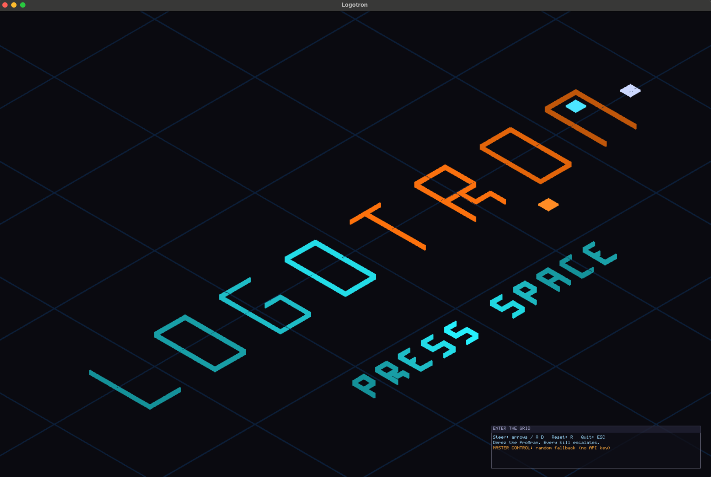

# Logotron



**Light cycles, and an LLM designs your next opponent.**

Single-player, you against one AI cycle at a time. Leave a solid
light-wall trail behind you; crash into any wall, any trail, any
opponent, and the round is over. Beat the AI and the Weirden
Director (an LLM holding the same ops grammar as everything else)
studies the round and authors the next opponent: new personality,
new tactics. Occasionally it mutates the arena mid-match, because it
can.

## Why this exists

Logotron is the second example game for Logosphere (Eden was the
first). Its purpose is to:

1. Demonstrate a **playable gameplay loop** built on the engine
   (Eden is a static tableau; this moves).
2. Exercise the **LLM module** end-to-end against both remote
   providers (OpenAI, Anthropic) and local OpenAI-compatible servers
   (`mlx_lm.server` on Apple Silicon, llama-server, Ollama, LM Studio).
3. Showcase the **KG + event bus** with live-growing graph topology
   (every trail segment is a new node with relations).

## Design principles

- **Tight scope first.** MVP is one arena, two cycles, text HUD, no
  persistent state. Round ends in seconds. Everything else is later.
- **TDD per feature.** No mechanic ships without a test file that
  measures observable behavior (cycle position after N ticks, trail
  cell count, collision result).
- **Full instrumentation.** Every tick emits measured state to
  stderr when diagnostics are enabled. No silent state.
- **LLM remote-first.** Default is remote provider via `OPENAI_API_KEY`
  or `ANTHROPIC_API_KEY` env vars. Local MLX-LM (or any OpenAI-compatible
  server) is opt-in via `LOGOTRON_LLM_URL`. The game degrades gracefully
  to a built-in default AI if no LLM is reachable.
- **ENGINE vs LOGOTRON work is called out in every commit prefix.**
  Game-specific code lives in `examples/logotron/`. If we discover
  an engine gap, we fix it in `src/` with a `feat:` / `fix:` prefix
  in a separate commit.

## Acknowledgments

- **Tron** (1982 film, Disney; 1982 arcade, Bally Midway), the
  light-cycle concept and visual lineage.
- **Supaplex** (1991, Dream Factory), the circuit-board aesthetic
  inspiration, even though we pivoted off the puzzle mechanics.
- **Contributor Covenant, Bevy, Godot, O3DE**, patterns that shaped
  our module architecture.

The name is a portmanteau: **Logos** (Greek for word/reason, the
engine's core metaphor) + **Tron**. It's also a nod to Supaplex's
"infotron" (the collectible chip).

## Status

Playable loop with the LLM Weirden Director live: player drives a
cycle with arrow keys, AI cycles run tactic-driven behaviors, trails
land in the KG each tick, and on each round the Director authors a
fresh opponent (personality, tactics, arena mutations) through the
validated KG-ops grammar. Guarded by headless acceptance tests for
the full game loop, director application, personality swaps, vision
memory, and wall visibility. See [GAME_DESIGN.md](GAME_DESIGN.md)
for the current feature map.

## Gameplay roadmap (rough)

| Slice | Mechanic |
|---|---|
| v0.1 | Arena scaffold, one cycle on screen, no movement |
| v0.2 | Cycle moves in a direction, test asserts position after N ticks |
| v0.3 | Player input turns cycle, arrow keys |
| v0.4 | Trails laid behind cycles, KG holds segments |
| v0.5 | Collision detection with trails + arena walls |
| v0.6 | Second cycle (static AI, "go straight") |
| v0.7 | AI behavior primitives registry (avoid_walls, chase, mirror, etc.) |
| v0.8 | Round loop, detect crash, end round, reset arena |
| v0.9 | LLM Weirden Director generates next AI tactics between rounds |
| v1.0 | Weirden arena-mutation remix (occasional, typed tool schema) |

Each slice ships with tests.

## Build and run

Build as part of the main CMake project:
```bash
cmake --build build --target logotron
./build/logotron/logotron
```

Set provider:
```bash
export OPENAI_API_KEY="sk-..."
./build/logotron/logotron
```

Or for a local MLX-LM server (Apple Silicon, Metal-accelerated):
```bash
# In another terminal, start the server with the model you want.
mlx_lm.server --model mlx-community/Qwen2.5-14B-Instruct-4bit --port 8080

# Point Logotron at it.
export LOGOTRON_LLM_PROVIDER=mlx
export LOGOTRON_LLM_URL="http://localhost:8080"
export LOGOTRON_LLM_MODEL="mlx-community/Qwen2.5-14B-Instruct-4bit"
./build/logotron/logotron
```

Any OpenAI-compatible server works the same way (llama.cpp's
`llama-server`, Ollama on `:11434`, LM Studio on `:1234`).

With no LLM configured, the game runs against a default built-in AI.

## License

Inherits the [Logosphere License 1.0](../../LICENSE.md).
