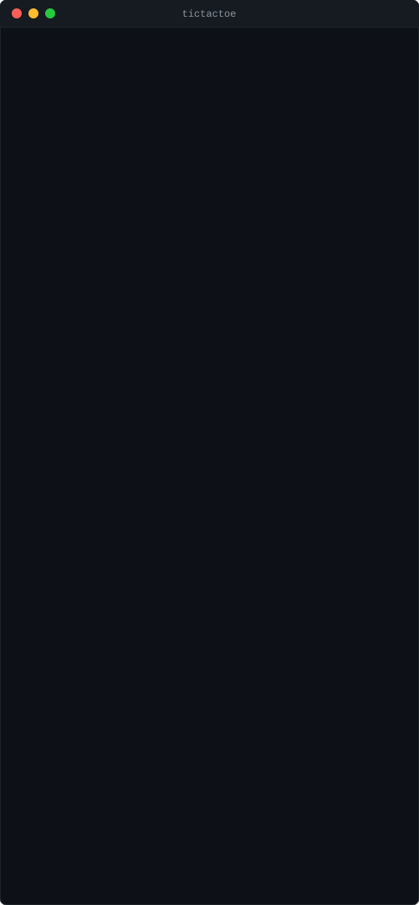

# Tic-Tac-Toe on Logosphere

A headless/console tic-tac-toe example that runs on the Logosphere
Knowledge Graph directly, without the windowing/rendering layer. It builds
under every `LOGOSPHERE_PROFILE` (`core`, `physics`, `full`) — including
plain Linux, where the full engine (software rasterizer, Metal lighting,
GLFW) doesn't build at all (macOS arm64 only).

## Demo



A self-contained, looping SVG recording of a real scripted playthrough
(`printf "0 0\n1 1\n0 1\n1 0\n0 2\n" | ./tictactoe`) — no video, no JS,
just SMIL animation, so it plays inline right here on GitHub.

## How it maps onto the engine

Logosphere's most portable layer is the Knowledge Graph (`kg::KGModule`)
and its ontology system — the same layer every example game (Eden,
Logotron, Logogenesis) uses to model entities, and the one that needs no
rendering, physics, or platform code. This example uses exactly that,
following `docs/GETTING_STARTED.md`:

- **Ontology** (`schema/tictactoe.yaml`) declares `Board`, `Cell` and
  `Player` on top of the engine's base `logosphere` schema. The registry
  in `src/generated/` is produced by the repo's own
  `scripts/generate_registry.py`.
- **Relations** are the engine's, not the game's, and that is deliberate:
  the generator derives the registry's relation set solely from the
  engine's `WorldRelationType` enum, so a game-declared relation would be
  dropped on the next regeneration (`examples/eden/schema/eden.yaml`'s
  `EdenRelationType` is decorative for the same reason). The game uses
  `HAS_PART` for the board's cells and `MANAGES` for a player's claim on
  a square, as logotron reuses the engine's set.
- **Knowledge Graph**: the board is one `Board` entity `HAS_PART` nine
  `Cell` entities (with `row`/`col`/`mark` properties), plus two `Player`
  entities. Making a move sets a cell's `mark` property and creates a
  `MANAGES` relation from the player to the cell — see
  `src/tictactoe.h`.
- **EventBus**: the KG auto-emits on `bus.relations()` and
  `bus.state_changes()` whenever a relation or property changes (see
  `tests/test_relation_events.cpp` / `tests/test_kg_setproperty_events.cpp`
  for the mechanism). `src/main.cpp` subscribes to `relations()` to log
  each move as it's recorded — games observe these, they don't emit them
  by hand.

Win/draw detection itself is plain game logic (`TicTacToe::check_winner`,
`TicTacToe::is_full` in `src/tictactoe.h`), computed synchronously after
each move rather than routed through the KG — same as how the engine's own
examples mix KG-driven state with ordinary game code.

## Build & play

```bash
cmake -S . -B build -DLOGOSPHERE_PROFILE=core   # or `physics`, or `full` on macOS
cmake --build build --target tictactoe
./build/tictactoe/tictactoe
```

Enter moves as `row col` (each `0`-`2`), e.g.:

```
Player X, enter row col: 1 1
```

Run the automated test suite:

```bash
cmake --build build --target test_tictactoe
./build/test_tictactoe
```

## Windowed (macOS) version

This example deliberately skips `Logosphere::IApplication` and `Engine`,
which need the `full` profile (macOS arm64, GLFW, Metal). To grow this into
a windowed example like `examples/eden/`:

1. Implement `class TicTacToeApp : public Logosphere::IApplication`
   (`include/application.h`), following `docs/GETTING_STARTED.md` steps
   3-4 and `examples/eden/src/main.cpp`. `initialize_game()` would call
   `engine_->get_kg().extendOntology(tictactoe::ontology::registry())` and
   build the board the same way `tictactoe::TicTacToe` already does.
2. Render marks either as `Particle`s placed on a 3x3 world grid (simplest
   — reuse the engine's existing particle rendering) or by drawing
   directly into the framebuffer via the software rasterizer
   (`include/logosphere/rendering/draw_surface.h`).
3. Route `handle_mouse_button`/`handle_key` to pick a cell instead of
   reading `row col` from stdin.
4. Copy `examples/eden/CMakeLists.txt` for the target: link `logosphere`,
   `glfw`, and the Cocoa/Metal/QuartzCore frameworks it lists, and add
   `add_subdirectory(examples/tictactoe)` to the `full`-profile examples
   section of the root `CMakeLists.txt` (it's already registered earlier
   for the headless build — don't duplicate the subdirectory call, just
   extend `examples/tictactoe/CMakeLists.txt` itself with a windowed
   target guarded by `if(LOGOSPHERE_FULL)`).
5. Build and run with `-DLOGOSPHERE_PROFILE=full` on macOS arm64:
   `cmake --build build --target tictactoe && ./build/tictactoe/tictactoe`.
